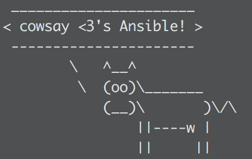

:title: Python Automation Using Ansible, Fabric, and Supervisor
:css: hovercraft.css

This is a presentation given by Jared Ondricek at the NOVA-Python Meetup.com group
on 10/27/2016.

You can render this presentation to HTML with the command::

    hovercraft presentation.rst outdir

And then view the outdir/index.html file to see how it turned out.

Here is a relatively easy way to present this in an offline manner,
such as for a conference presentation.

    cd outdir
    python3 -m http.server

Then going to 127.0.0.1:8000 in your browser. Enjoy!

----

Python Automation
=================

Using Ansible, Fabric, and Supervisor
-------------------------------------

Jared Ondricek
sdfkjhdsfkjsdhf

flamableconcrete@gmail.com
https://github.com/flamableconcrete

NOVA-Python 10/27/2016

----

Who am I?
=========

* The MITRE Corporation

* Python enthusiast

* DevOps junkie

* Android forensics and reverse engineering

.. note::

    * PyLunch

----

How I view this Talk
====================

.. image:: images/lightning-talk.png
    :height: 150px
    :width: 260px

Ansible

.. image:: images/lightning-talk.png
    :height: 150px
    :width: 260px

Supervisor

.. image:: images/lightning-talk.png
    :height: 150px
    :width: 260px

Fabric

----

But First
=========

.. image:: images/story-time.jpg
    :height: 600px
    :width: 800px

----

Story Time
==========

    * Started a new project
    * Bash scripts
    * Python scripts
    * Need a database
    * Python module

.. note::

    * Of course it doesn't stop there

----

Still Story Time
================

    * Message Queue
    * Other apt-get dependencies
    * Wrote a Flask web app
    * All of a sudden, spaghetti code

----

Then Someone Asks
=================

.. image:: images/can-i-have-it.jpg
    :height: 450px
    :width: 750px

----

Your Instructions
=================

.. note::

    * You give them nice instructions
    * They're pretty
    * Easy to follow

----

Their Interpretation
====================

.. image:: images/spaghetti.jpg

----

You Want to Scream
==================

----

This is Why You Should
======================

----

Ansible
=======

* IT Automation Tool
* Deploys/provisions software onto systems
* Agent-less - ssh only
* Idempotent

.. note::

    * Agent-less
        * Has anyone used Chef/Salt/Puppet?
    * Idempotence
        * Idempotence is the property of certain operations that can be applied multiple times without changing the result beyond the initial application.
        * In the case of methods or subroutine calls with side effects, the modified state remains the same after the first call.

----

Cowsay Support
==============

----

How do I get it?
================

Linux/OS X

.. code :: bash

    $ sudo pip install ansible

Windows

* Cry
* Bash on Windows 10
* Ansible Babun Bootstrap (Github)

----

Key Components
==============

* `Inventory file`_
* `Ad-hoc commands`_
* `Configuration file`_
* `Playbooks`_
* `Roles`_
* `700+ modules`_
* `Ansible Galaxy`_

.. _Inventory file: http://docs.ansible.com/ansible/intro_inventory.html
.. _Ad-hoc commands: http://docs.ansible.com/ansible/intro_adhoc.html
.. _Configuration file: http://docs.ansible.com/ansible/intro_configuration.html
.. _Playbooks: http://docs.ansible.com/ansible/playbooks.html
.. _Roles: http://docs.ansible.com/ansible/playbooks_roles.html
.. _700+ modules: http://docs.ansible.com/ansible/modules.html
.. _Ansible Galaxy: http://docs.ansible.com/ansible/galaxy.html

.. note::

    * We will go over these sections on the following slides

----

`Inventory File`_
=================

* Master or local inventory
* INI syntax
* Groups

.. code::
    
    (contents of /etc/ansible/hosts)

    mail.example.com

    [webservers]
    foo.example.com
    bar.example.com

    [dbservers]
    one.example.com
    two.example.com
    three.example.com

.. _Inventory File: http://docs.ansible.com/ansible/intro_inventory.html

----

`Ad-hoc Commands`_
==================

* One off commands you don't need to save

.. code:: bash

    $ ansible webservers -a "touch /home/user/foo.log"
    $ ansible mail.example.com -a "/sbin/reboot" -u username --become -K
    $ ansible dbservers -m copy -a "src=/etc/hosts dest=/tmp/hosts"

.. _Ad-hoc Commands: http://docs.ansible.com/ansible/intro_adhoc.html

.. note::

    * -a is for ad-hoc command
    * --become is for becoming another user, by default sudo
    * -K is to ask for sudo password
    * -m is to use a module

----

`Configuration File`_
=====================

* ansible.cfg (Master or local)
* Pre-set custom inventory
* Pre-set flags
* Convenient for sudo

.. _Configuration File: http://docs.ansible.com/ansible/intro_configuration.html

----

`Playbooks`_
============

* Infrastructure as code
* YAML syntax
* Replace <*deploy* | *install* | *configure*>.sh
* Look at some examples_
* Usage:

.. code:: bash

    $ ansible-playbook playbook.yml

.. _Playbooks: http://docs.ansible.com/ansible/playbooks.html
.. _examples: https://github.com/ansible/ansible-examples

.. note::

    * language_features/mysql.yml
    * language_features/rabbitmq.yml
    * language_features/get_url.yml

----

`Roles`_
========

* Playbook management
* roles directory
* Common structure_
* Follow `Best Practices`_
* Look at examples_ again

.. _Roles: http://docs.ansible.com/ansible/playbooks_roles.html
.. _structure: http://docs.ansible.com/ansible/playbooks_roles.html#roles
.. _Best Practices: http://docs.ansible.com/ansible/playbooks_best_practices.html
.. _examples: https://github.com/ansible/ansible-examples

.. note::
    
    * wordpress-nginx is straightforward    

----

`700+ Modules`_
===============

* Modules for everything!
    * Cloud!
    * Infrastructure!
    * Database!
    * Packaging!
    * Python! (virtualenvs, django, etc.)
* Google: ansible ___
    * copy, template, rabbitmq, etc.

.. _700+ modules: http://docs.ansible.com/ansible/modules.html

.. note::
    
    * Specific modules will depend on what you are trying to do

----

`Ansible Galaxy`_
=================

* User contributed roles
* ansible-galaxy command

.. _Ansible Galaxy: http://docs.ansible.com/ansible/galaxy.html

----

`edX`_
======

* Just one example in real life
* edX.org provides free online courses from some major universities
* https://github.com/edx/configuration

.. _edX: https://www.edx.org

----

What's Next?
============

* You've installed a bunch of stuff
* Is any of it running?
* Check manually
* Monitor processes
* Supervisor_!

.. _Supervisor: http://supervisord.org

----

Supervisor
==========

* Let's you control and monitor process state on UNIX-like systems
* A program that runs other programs

----

Components
==========

* supervisord
    * should run automatically on startup
* supervisorctl
    * CLI
* supervisord.conf

----

Installation
============

.. code:: bash
    
    $ sudo apt-get install supervisor
    $ sudo yum install supervisor
    $ sudo pip install supervisor

Gotcha: if you pip install, it is on you to (auto)start the supervisord process

----

Configuration File Driven
=========================

The config file can define the set of programs that must be run in

* a development environment
* a production environment

for a single project

----

Manage processes through:

* Command line tool (supervisorctl)
* Web interface
* XML-RPC

----

Config file sections of note are "include" and "program". Let's take a look at the docs_

Enable the [inet_http_server] if you want the web interface.

.. _docs: http://supervisord.org/configuration.html#program-x-section-settings

----

Processes that Supervisor controls must run in foreground - can't be daemonized.

Multiple programs can be put in process groups to manage simultaneously.

----

Great. Now you've told Supervisor to do something. Is it doing it?

.. image:: images/supervisor-web.png

----

supervisorctl
=============

* help
* status
* start
* stop
* tail

----

Always good to check the logs if your process isn't starting, or frequently restarting. 

----

Ansible can be used to install Supervisor, then add programs that are managed by it. It is also used in some Docker containers to run multiple processes instead of just one.

----

DEMO
====

----

What about Fabric_?
===================

.. _Fabric: http://www.fabfile.org/

----

Python 2 library for automating and streamlining app deployment over ssh. A little overlap with Ansible, but still useful.

